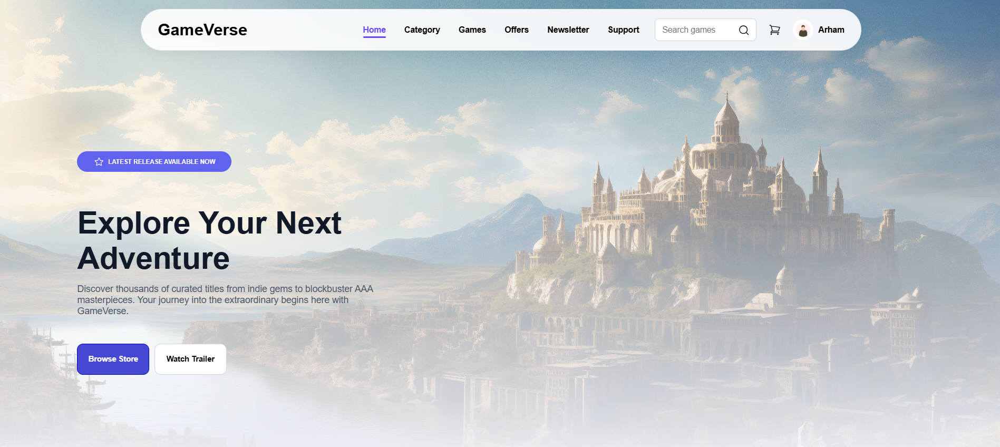

# 🎮 GameVerse

A modern and responsive gaming store landing page built with **HTML5** and **CSS3**.  
GameVerse features a clean, immersive UI inspired by modern gaming platforms, with sections for featured games, categories, special offers, and more.

---

## 📸 Preview

> Add screenshots here after uploading them.

### Home Page



---

## 🚀 Live Demo

🔗 **Website:** https://gameverse-store.vercel.app/

---

## ✨ Features

- 🎨 Modern gaming-inspired interface
- 📱 Responsive layout for different screen sizes
- 🧭 Fixed navigation bar
- 🎮 Hero section with call-to-action
- 🗂️ Game categories
- 🔥 Featured games section
- 💸 Special offers section
- ⭐ Clean card-based design
- 🎯 Smooth hover effects and transitions
- 📦 Organized project structure

---

## 🛠️ Built With

- HTML5
- CSS3
- Flexbox
- CSS Grid
- Google Fonts
- SVG Icons

---

## 📂 Project Structure

```
GameVerse/
│
├── assets/
│   ├__ images/
│
├── screenshots/
│
├── index.html
├── style.css
└── README.md
```

---

## 🎨 Design Highlights

The UI focuses on creating a modern gaming experience using:

- gaming-inspired color palette
- Rounded cards
- Soft shadows
- Hover animations
- Clean typography
- Spacious layouts
- Modern CTA buttons

---

## 📖 Sections Included

- Header
- Hero
- Categories
- Featured Games
- Special Offers
- Newsletter Subscription
- Footer

---

## 💡 What I Learned

While building this project, I practiced and improved my understanding of:

- Semantic HTML
- CSS Flexbox
- CSS Grid
- Positioning
- Responsive layouts
- Background images
- Cards and UI components
- Hover effects
- Clean folder structure
- Modern web design principles

---

## 🎯 Future Improvements

Some features I plan to add in future versions:

- JavaScript interactivity
- Search functionality
- Shopping cart
- Dark / Light mode
- Game details page
- Product filtering
- Login & Signup pages
- Backend integration
- Payment system

---

## 📱 Responsive Design

The website is designed with responsiveness in mind to provide a better user experience across different devices.

---

## ⚡ Performance

- Lightweight project
- Optimized assets
- Simple and maintainable code
- Fast loading layout

---

## 🤝 Contributing

Suggestions and improvements are always welcome.

If you have ideas to improve the project, feel free to fork the repository and create a pull request.

---

## 👨‍💻 Author

**Muhammad Arham Ali**

GitHub:
https://github.com/Arhamali06

LinkedIn:
https://www.linkedin.com/in/arhamali06/

---

## ⭐ Support

If you like this project, consider giving it a ⭐ on GitHub.
It really helps and motivates me to build more projects.

---

## 📄 License

This project is created for educational and portfolio purposes.