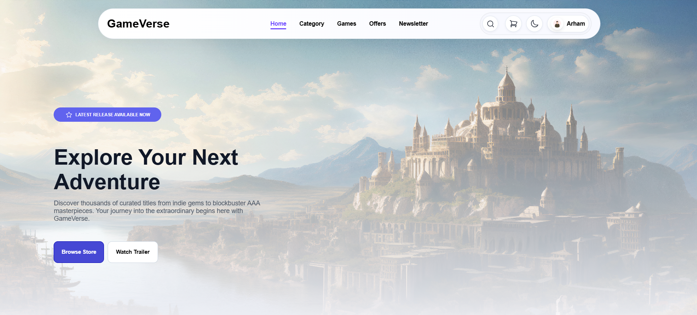
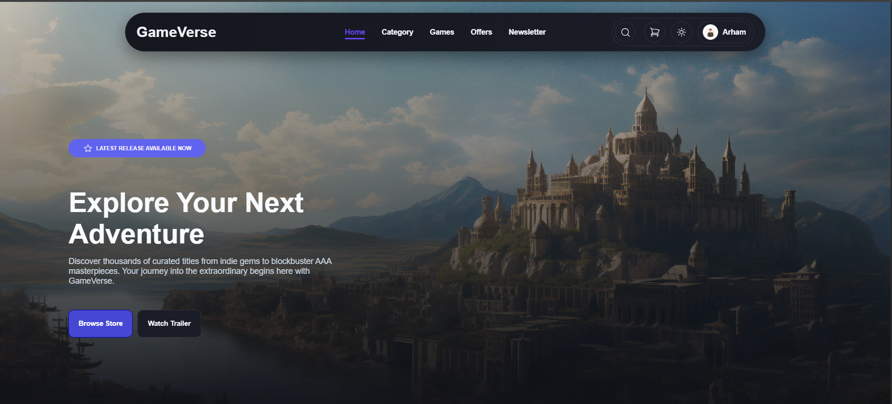

# 🎮 GameVerse

GameVerse is a responsive gaming store and cart experience built with **HTML5**, **CSS3**, and **JavaScript**. It goes beyond a simple static layout and includes an interactive header, dark theme support, scroll-based UI effects, JavaScript-generated game cards, and a persistent shopping cart.

---

## 📸 Preview

### Home Page




---

## 🚀 Live Demo

🔗 **Website:** https://gameverse-store.vercel.app/

---

## ✨ Features

- Responsive layout for desktop, tablet, and mobile screens
- Sticky glass-style navigation bar
- Mobile hamburger menu with open and close states
- Search control with expandable input and clear button
- Theme toggle with dark mode and light mode support
- Dark theme preference saved in `localStorage`
- Hero section with strong call-to-action buttons
- 5 game category cards
- 8 featured games rendered dynamically from JavaScript
- Top Rated badge on the highlighted featured game
- 2 special offer cards with pricing and discounts
- Add to Cart buttons on featured games and Buy Now buttons on special offers
- Persistent cart state saved in `localStorage`
- Cart badge that updates with the total number of items in the cart
- Dedicated cart page with item listing, quantity controls, remove actions, and order summary
- Promo code support on the cart page
- Proceed to Checkout confirmation modal with order number and total paid
- Scroll reveal animations for sections and cards
- Active navigation state that updates on click and scroll
- Newsletter subscription call-to-action
- Responsive footer with grouped links and social buttons
- Smooth hover effects, transitions, and clean card styling

---

## 🛠️ Built With

- HTML5
- CSS3
- JavaScript
- CSS Grid
- Flexbox
- `IntersectionObserver`
- `localStorage`
- SVG icons

---

## 📖 Sections Included

- Header
- Hero
- Categories
- Featured Games
- Special Offers
- Cart Page
- Checkout Confirmation Modal
- Newsletter
- Footer

---

## 🛒 Cart & Checkout Flow

The cart system is shared between `index.html` and `cart.html` using `localStorage`.

- Clicking Add to Cart on a featured game stores that game in the cart.
- Clicking Buy Now on a special offer also adds that item to the cart.
- If the same game is added again, its quantity increases instead of creating a duplicate card.
- Each cart item is saved with its name, category, price, image, quantity, and display metadata.
- The cart badge in the header updates automatically to reflect the total quantity of saved items.
- On the cart page, items can be increased, decreased, or removed.
- The order summary recalculates subtotal, discount, and total as the cart changes.
- When Proceed to Checkout is clicked, a confirmation modal appears with a generated order number and the final amount paid.
- After checkout, the cart is cleared and the badge resets.

---

## 📂 Project Structure

```
GameVerse/
├── assets/
│   └── images/
│       ├── category/
│       ├── games/
│       ├── header/
│       └── hero/
├── ScreenShots/
├── .vscode/
│   └── settings.json
├── index.html
├── cart.html
├── script.js
├── style.css
└── README.md
```

---

## 🎨 Design Highlights

The UI is built around a modern gaming storefront look with:

- layered hero imagery
- bold accent colors
- rounded cards and pills
- soft shadows and glass effects
- smooth micro-interactions
- clear visual hierarchy
- light and dark theme styling

---

## 💡 What I Practiced

This project helped me strengthen my understanding of:

- Semantic HTML structure
- Responsive layout techniques
- DOM manipulation in JavaScript
- Theme switching and persistence
- Persistent cart state with `localStorage`
- Navigation state tracking
- Scroll reveal animations
- Card-based UI composition
- CSS Grid and Flexbox
- Accessible interactive controls
- Multi-page UI state sharing

---

## 🎯 Notes

- The search, browse, trailer, and subscribe controls are currently UI-focused.
- The cart experience is functional and shared across the home page and cart page through `localStorage`.
- The page is designed as a portfolio-style storefront with a working cart and checkout confirmation flow.

---

## ⚡ Performance

- Lightweight single-page build
- Optimized image-based content
- No framework overhead
- Smooth, browser-native interactions

---

## 👨‍💻 Author

**Muhammad Arham Ali**

GitHub: https://github.com/Arhamali06

LinkedIn: https://www.linkedin.com/in/arhamali06/

---

## 📄 License

This project is for educational and portfolio purposes.